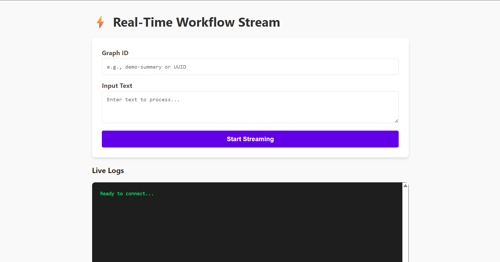
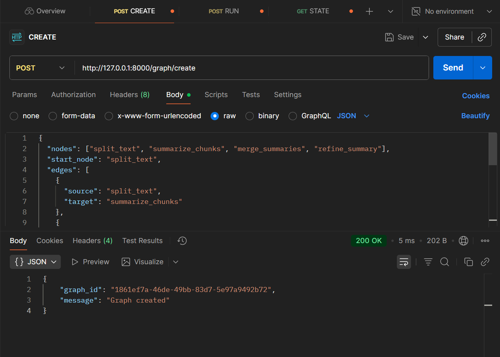
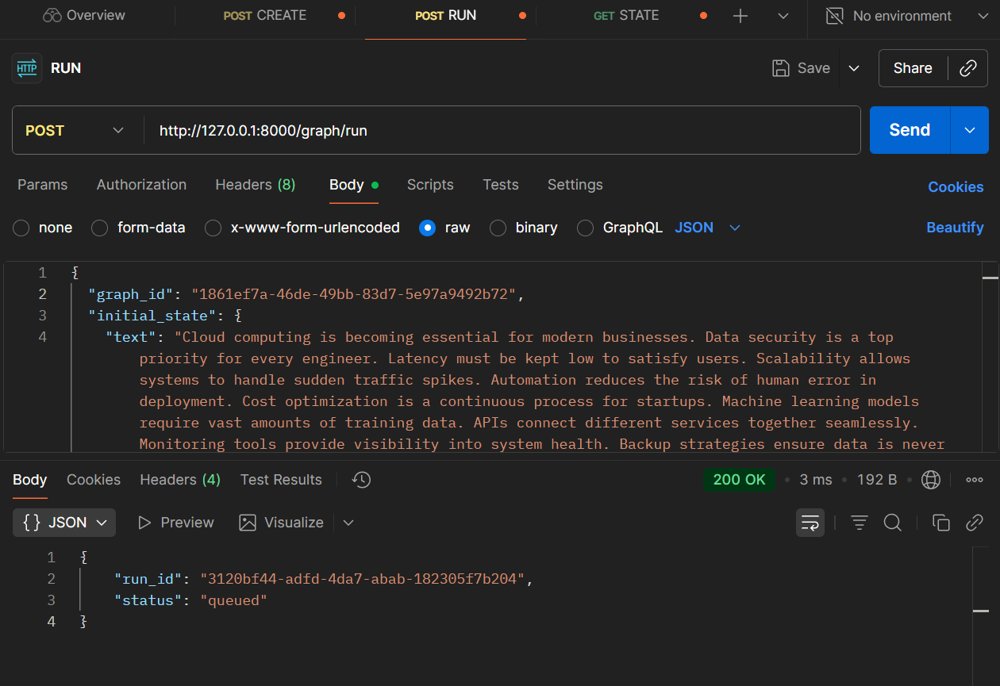
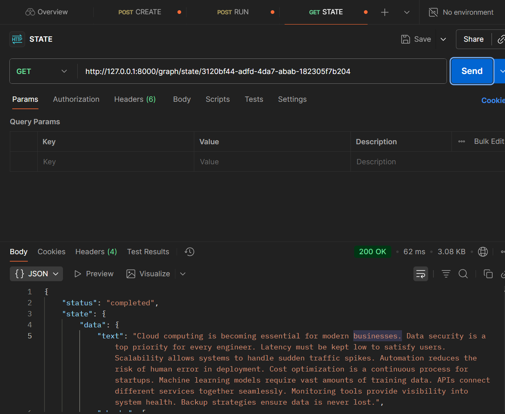
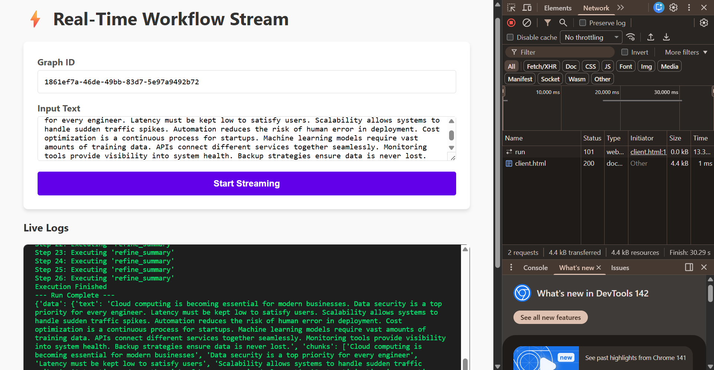

# AI Intern Assignment: Agent Workflow Engine

A lightweight, purely Python-based workflow engine designed to execute agentic workflows with state management, branching, and looping capabilities.

This project demonstrates a backend system that can define a sequence of steps (nodes), connect them (edges), and execute them asynchronously via REST APIs or in real-time via WebSockets.

## Key Features

- **Graph-Based Execution:** Nodes are Python functions; edges define the flow (Linear or Conditional).
- **Cyclic Workflows:** Supports loops (e.g., "Refine until quality < X") naturally via conditional edges.
- **State Management:** Uses Pydantic to ensure type-safe state transitions between nodes.
- **Hybrid Execution:**
  - **Async REST:** Uses FastAPI `BackgroundTasks` for non-blocking execution.
  - **Real-Time WebSockets:** Streams execution logs step-by-step to the client.
- **Modular Design:** Separates the core _Engine_, the _Tool Registry_, and the _API Layer_.

---

## Tech Stack

- **Language:** Python 3.9+
- **Framework:** FastAPI
- **Server:** Uvicorn
- **Validation:** Pydantic
- **Frontend (Test):** HTML/JS (Native WebSocket API)

---

## Project Structure

```text
Tredence-Assignment/
├── app/
│   ├── __init__.py
│   ├── main.py        # FastAPI entry point & API routes
│   ├── engine.py      # Core Graph Engine (Nodes, Edges, Loop Logic)
│   ├── registry.py    # Tool definitions (Option B: Summarization Logic)
│   └── models.py      # Pydantic models for API & State validation
├── assets/            # Screenshots and images
├── client.html        # Frontend Dashboard for testing WebSockets vs REST
├── requirements.txt   # Project dependencies
└── README.md          # Documentation
```

---

## Setup & Installation

1.  **Clone the repository**

    ```bash
    git clone https://github.com/sdiv0503/Tredence-Assignment.git
    cd tredence-assignment
    ```

2.  **Create a Virtual Environment**

    ```bash
    # Windows
    python -m venv venv
    venv\Scripts\activate

    # Mac/Linux
    python3 -m venv venv
    source venv/bin/activate
    ```

3.  **Install Dependencies**

    ```bash
    pip install -r requirements.txt
    ```

4.  **Start the Server**

    ```bash
    uvicorn app.main:app --reload
    ```

    The API will be available at `http://127.0.0.1:8000`.

---

## Usage Guide

### 1\. Using the Client Dashboard (`client.html`)

For the best testing experience, open the provided `client.html` file in your browser. It allows you to input a Graph ID, customize the input text, and compare the REST API (Async polling) vs. WebSocket (Streaming) side-by-side.



---

## API Reference

### 1\. Create Graph (`POST /graph/create`)

Define a custom workflow structure dynamically.

**Input JSON:**

```json
{
  "nodes": [
    "split_text",
    "summarize_chunks",
    "merge_summaries",
    "refine_summary"
  ],
  "start_node": "split_text",
  "edges": [
    { "source": "split_text", "target": "summarize_chunks" },
    { "source": "summarize_chunks", "target": "merge_summaries" },
    { "source": "merge_summaries", "target": "refine_summary" },
    {
      "source": "refine_summary",
      "condition": "status",
      "mapping": { "continue": "refine_summary", "stop": null }
    }
  ]
}
```

**Output JSON:**

```json
{
  "graph_id": "1861ef7a-46de-49bb-83d7-5e97a9492b72",
  "message": "Graph created"
}
```



---

### 2\. Run Graph (`POST /graph/run`)

Triggers a run in the background and returns a Run ID immediately.

**Input JSON:**

```json
{
  "graph_id": "1861ef7a-46de-49bb-83d7-5e97a9492b72",
  "initial_state": {
    "text": "Cloud computing is becoming essential for modern businesses. Data security is a top priority for every engineer. Latency must be kept low to satisfy users. Scalability allows systems to handle sudden traffic spikes. Automation reduces the risk of human error in deployment. Cost optimization is a continuous process for startups. Machine learning models require vast amounts of training data. APIs connect different services together seamlessly. Monitoring tools provide visibility into system health. Backup strategies ensure data is never lost."
  }
}
```

**Output JSON:**

```json
{
  "run_id": "3120bf44-adfd-4da7-abab-182305f7b204",
  "status": "queued"
}
```



---

### 3\. Get Run State (`GET /graph/state/{run_id}`)

Poll this endpoint to check if the background task is finished and retrieve logs.

**Output JSON (Completed Run):**

```json
{
  "status": "completed",
  "state": {
    "data": {
      "text": "Cloud computing is becoming essential for modern businesses...",
      "chunks": [
        "Cloud computing is becoming essential for modern businesses",
        "Data security is a top priority for every engineer",
        "..."
      ],
      "chunk_summaries": [
        "Cloud computing is...",
        "Data security is...",
        "..."
      ],
      "current_summary": "Cloud computing is... Data security is... Latency",
      "summary_length": 49,
      "status": "stop"
    },
    "history": [
      "split_text",
      "summarize_chunks",
      "merge_summaries",
      "refine_summary",
      "refine_summary",
      "..."
    ]
  },
  "logs": [
    "Step 1: Executing 'split_text'",
    "Step 2: Executing 'summarize_chunks'",
    "Step 3: Executing 'merge_summaries'",
    "Step 4: Executing 'refine_summary'",
    "Step 5: Executing 'refine_summary'",
    "...",
    "Step 26: Executing 'refine_summary'",
    "Execution Finished"
  ]
}
```



---

### 4\. WebSocket Run (Real-Time)

Streams logs line-by-line as the agent executes.

- **Endpoint:** `ws://127.0.0.1:8000/ws/run`
- **Payload:** Same as `POST /graph/run`.



---

## Design Decisions

1.  **Separation of Concerns:** The `WorkflowEngine` is completely decoupled from FastAPI. It can technically run as a standalone CLI tool, making testing easier.
2.  **Hybrid Execution:** I implemented `step_callback` in the engine. This allows a single `run()` method to support both "Fire-and-Forget" (REST) and "Streaming" (WebSockets) without duplicating logic.
3.  **In-Memory Storage:** Per assignment requirements, graphs and runs are stored in global dictionaries. In a production environment, I would replace this with Redis (for state) and PostgreSQL (for persistence).

## Future Improvements

With more time, I would implement:

- **Persistence:** Save workflow definitions and run history to a database.
- **DAG Validation:** Add a cycle detection algorithm (for non-looping graphs) or unreachable node detection during graph creation.
- **Frontend Visualization:** Use a library like React Flow to visualize the nodes and edges graphically.

---

